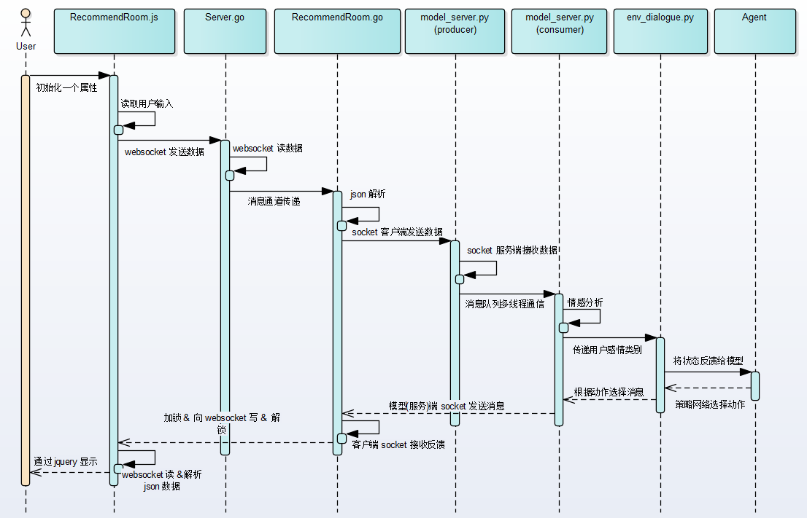
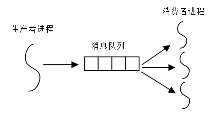
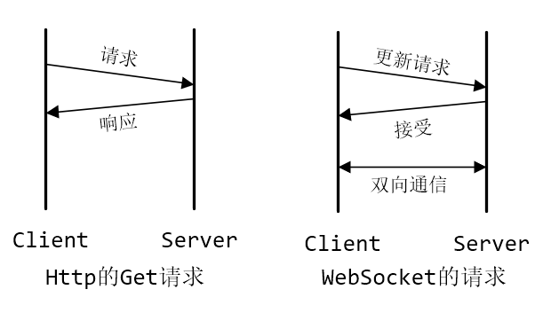
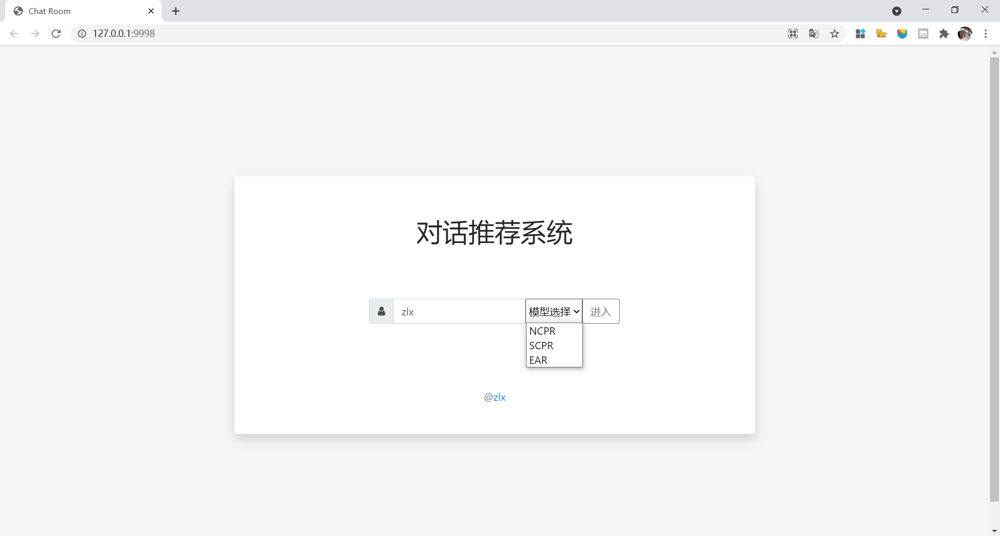
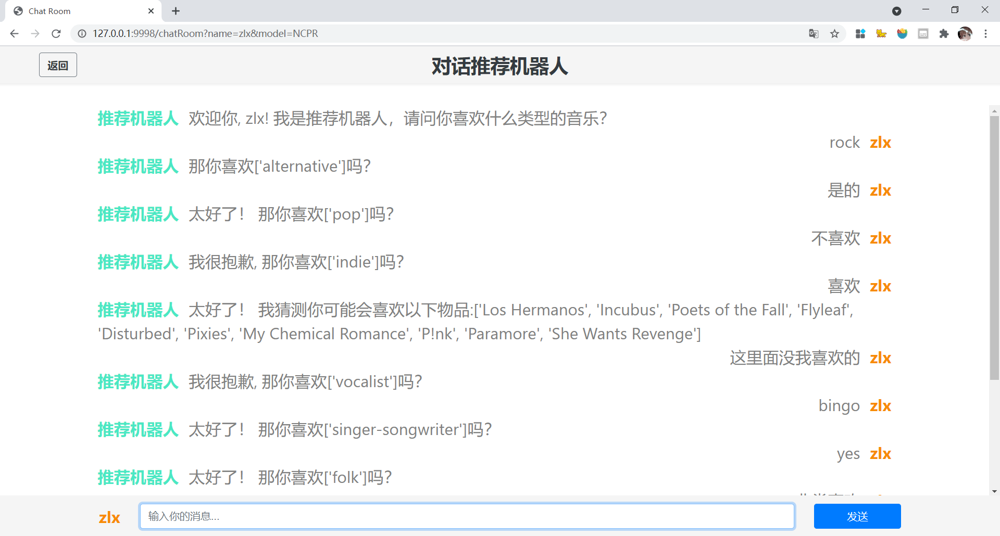
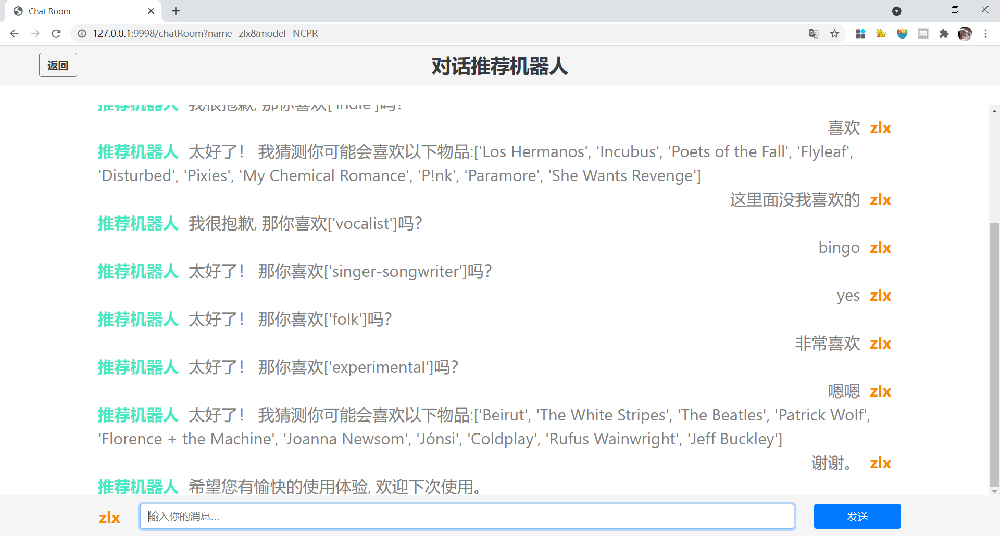
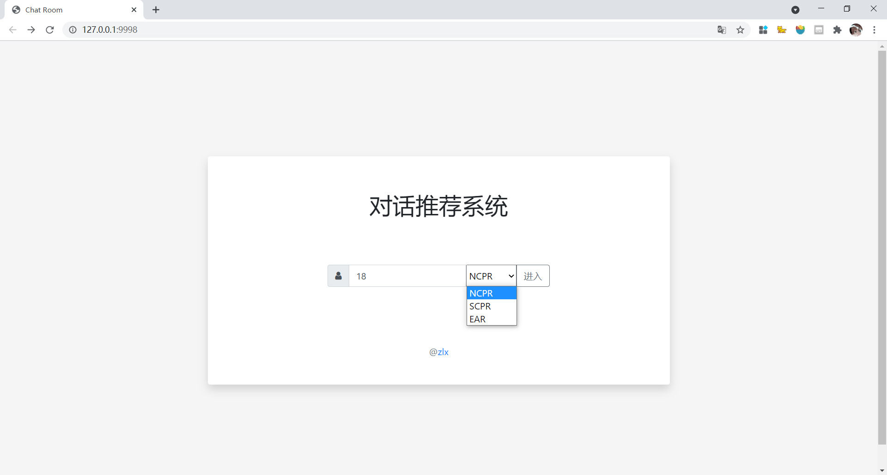
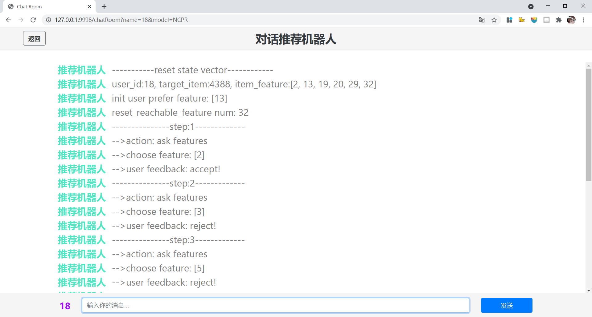
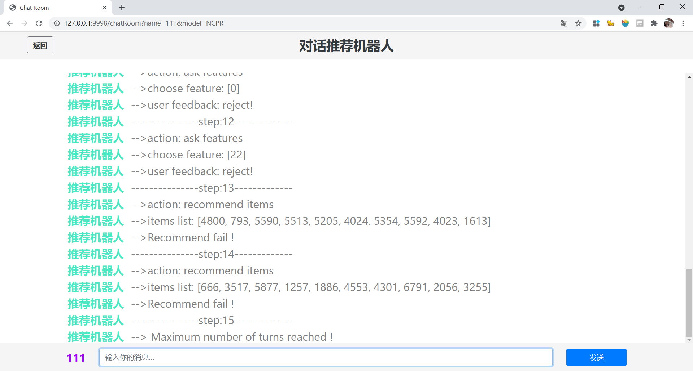

# NCPR
### **模型图**

 [模型图_v5.pdf](image\模型图_v5.pdf) 

### **对话推荐系统展示**

* 实时性
* 多样性
* 交互性

#### 客户端与服务器端通信

#### 线程间通信

​	使用经典的多线程并发协作模型——生产者-消费者模型。

#### 前后端的双向通信

​	使用WebSocket协议进行前后端的通信。

#### 对话推荐系统功能展示

模型选择页面：

用户交互过程：

系统做出用户心仪推荐

选择测试集用户：

显示测试的样例信息：

NCPR经过7轮交互做出成功推荐：

交互达到最大轮次则推荐失败：

